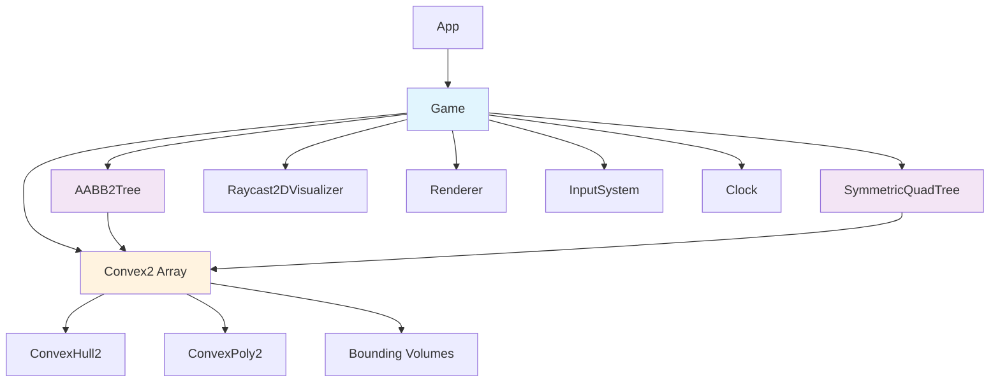

# Design Document: Convex Scene Editor

## Overview

The Convex Scene Editor is a C++ application built on a custom game engine that demonstrates computational geometry concepts through interactive 2D convex polygon manipulation and raycast performance analysis. The system architecture follows a modular design with clear separation between scene management, rendering, spatial optimization, and user interaction layers.

The design leverages existing engine capabilities (math utilities, rendering primitives, input handling) while implementing custom convex geometry algorithms and spatial partitioning structures (BVH and QuadTree) for raycast optimization.

## Steering Document Alignment

### Technical Standards

This design follows C++ best practices and game engine architecture patterns:
- **SOLID Principles**: Single responsibility for each class, open/closed for spatial structures
- **RAII**: Proper resource management for dynamically allocated convex objects
- **Const Correctness**: Render methods are const, mutators are non-const
- **Value Semantics**: Math types (Vec2, AABB2) use value semantics
- **Pointer Semantics**: Game objects use pointer semantics with manual memory management

### Project Structure

The implementation follows the existing engine project structure:
```
Code/Game/
├── Framework/
│   ├── App.cpp/hpp          # Application lifecycle (existing)
│   ├── GameCommon.cpp/hpp   # Global utilities (existing)
│   └── Main_Windows.cpp     # Entry point (existing)
└── Gameplay/
    ├── Game.cpp/hpp          # Main game logic (extend)
    ├── Convex.cpp/hpp        # NEW: Convex shape class
    ├── BVH.cpp/hpp           # NEW: BVH spatial partitioning
    └── QuadTree.cpp/hpp      # NEW: QuadTree spatial partitioning
```

## Code Reuse Analysis

### Existing Engine Components to Leverage

#### Math Library (`Engine/Math/`)
- **Vec2**: 2D vector operations, polar coordinate generation, rotation
- **AABB2**: Bounding box representation for spatial partitioning
- **Disc2**: Bounding disc for broad-phase culling
- **Plane2**: Half-space representation for convex hulls
- **ConvexHull2**: Plane-based convex representation (existing in reference Engine)
- **ConvexPoly2**: Vertex-based convex representation (existing in reference Engine)
- **RaycastResult2D**: Raycast result structure
- **RandomNumberGenerator**: Deterministic random number generation
- **MathUtils**: Dot product, cross product, angle utilities, point-in-polygon tests

#### Rendering System (`Engine/Renderer/`)
- **Vertex_PCU**: Position-Color-UV vertex structure
- **VertexUtils**: Primitive generation functions
  - `AddVertsForConvexPoly2D()`: Fill convex polygon
  - `AddVertsForLineSegment2D()`: Draw edges
  - `AddVertsForArrow2D()`: Draw surface normals
  - `AddVertsForDisc2D()`: Draw bounding discs
- **Renderer**: Drawing API with blend modes, state management
- **Camera**: Orthographic 2D camera
- **BitmapFont**: Text rendering for UI metrics

#### Core Systems (`Engine/Core/`)
- **Clock**: Time management, delta time, FPS calculation
- **InputSystem**: Keyboard and mouse input
- **EventSystem**: Event subscription/firing
- **StringUtils**: `Stringf()` for formatted text

#### Raycast Utilities (`Engine/Math/RaycastUtils.hpp`)
- **RaycastVsDisc2D()**: Ray-disc intersection (for broad-phase culling)
- **RaycastVsAABB2D()**: Ray-AABB intersection (for spatial structure traversal)
- **RaycastVsConvexHull2D()**: Ray-convex intersection (core algorithm)

### Integration Points

- **Game Class**: Extend existing `Game` class to add convex scene management
- **Rendering Pipeline**: Integrate with existing `Render()` method using `VertexList_PCU`
- **Input Handling**: Use existing `InputSystem` for keyboard/mouse controls
- **Debug Rendering**: Use existing `DebugRenderSystem` for debug visualization

## Architecture

### System Architecture



### Modular Design Principles

- **Single File Responsibility**:
  - `Convex.cpp/hpp`: Convex shape representation and operations only
  - `BVH.cpp/hpp`: BVH spatial partitioning only
  - `QuadTree.cpp/hpp`: QuadTree spatial partitioning only
  - `Game.cpp/hpp`: Scene orchestration and user interaction only

- **Component Isolation**:
  - Spatial structures are independent of each other
  - Convex shapes don't know about spatial structures
  - Rendering is separated from game logic

- **Service Layer Separation**:
  - Data: `Convex2`, `AABB2TreeNode`, `SymmetricQuadTreeNode`
  - Logic: Raycast algorithms, spatial structure queries
  - Presentation: Rendering methods in `Game`

- **Utility Modularity**:
  - Random convex generation is a standalone function
  - Vertex generation helpers are separate methods

## Components and Interfaces

### Component 1: Convex2 Class

**Purpose:** Represents a 2D convex polygon with dual representation (hull + poly) and bounding volumes for optimization.

**File:** `Code/Game/Convex.hpp`, `Code/Game/Convex.cpp`

**Interfaces:**
```cpp
class Convex2 {
public:
    // Constructors
    Convex2();
    Convex2(ConvexPoly2 const& convexPoly2);
    Convex2(ConvexHull2 const& convexHull2);
    Convex2(std::vector<Vec2> const& vertices);  // From vertex list

    // Queries
    bool IsPointInside(Vec2 const& point) const;
    bool RayCastVsConvex2D(RayCastResult2D& out_result,
                           Vec2 const& startPos,
                           Vec2 const& forwardNormal,
                           float maxDist,
                           bool discRejection = true,
                           bool boxRejection = false) const;

    // Transforms
    void Translate(Vec2 const& offset);
    void Rotate(float degrees, Vec2 const& refPoint = Vec2::ZERO);
    void Scale(float scaleFactor, Vec2 const& refPoint = Vec2::ZERO);
    void RebuildBoundingBox();

    // Data members
    ConvexHull2 m_convexHull;           // Plane representation
    ConvexPoly2 m_convexPoly;           // Vertex representation
    AABB2 m_boundingAABB;               // Bounding box
    Vec2 m_boundingDiscCenter;          // Bounding disc center
    float m_boundingRadius;             // Bounding disc radius
    float m_scale = 1.f;                // Current scale
    bool m_symmetricQuadTreeFlag = false; // For deduplication in QuadTree
};
```

**Dependencies:**
- `Engine/Math/ConvexHull2.hpp`
- `Engine/Math/ConvexPoly2.hpp`
- `Engine/Math/AABB2.hpp`
- `Engine/Math/Vec2.hpp`
- `Engine/Math/RaycastUtils.hpp`

**Reuses:**
- `ConvexHull2` for plane-based representation
- `ConvexPoly2` for vertex-based representation
- `RaycastVsConvexHull2D()` for ray intersection
- `RaycastVsDisc2D()` for broad-phase culling
- `RaycastVsAABB2D()` for box rejection
- `IsPointInsideConvexHull2D()` for point-in-polygon test

### Component 2: AABB2Tree Class (BVH)

**Purpose:** Binary space partitioning tree for accelerating raycast queries using axis-aligned bounding boxes.

**File:** `Code/Game/BVH.hpp`, `Code/Game/BVH.cpp`

**Interfaces:**
```cpp
struct AABB2TreeNode {
    AABB2 m_bounds;
    std::vector<Convex2*> m_containingConvex;
};

class AABB2Tree {
public:
    void BuildTree(std::vector<Convex2*> const& convexArray,
                   int numOfRecursive,
                   AABB2 const& totalBounds);

    void SolveRayResult(Vec2 const& startPos,
                        Vec2 const& forwardVec,
                        float maxDist,
                        std::vector<Convex2*>& out_latentRes);

    std::vector<AABB2TreeNode> m_nodes;
    int m_startOfLastLevel = 0;  // Index where leaf nodes begin

protected:
    int GetParentIndex(int index);
};
```

**Algorithm:**
- **Tree Structure**: Binary tree with alternating vertical/horizontal splits
- **Partitioning**: Uses convex bounding disc center for assignment
- **Depth**: `log2(numObjects) - 3` (minimum 3 levels)
- **Traversal**: Depth-first with AABB ray intersection tests

**Dependencies:**
- `Engine/Math/AABB2.hpp`
- `Engine/Math/RaycastUtils.hpp` (for `RaycastVsAABB2D()`)
- `Game/Convex.hpp`

**Reuses:**
- `AABB2` for node bounds
- `RaycastVsAABB2D()` for ray-box intersection tests
- `Convex2::m_boundingDiscCenter` for partitioning

### Component 3: SymmetricQuadTree Class

**Purpose:** Quad tree spatial partitioning for accelerating raycast queries using uniform grid subdivision.

**File:** `Code/Game/QuadTree.hpp`, `Code/Game/QuadTree.cpp`

**Interfaces:**
```cpp
struct SymmetricQuadTreeNode {
    AABB2 m_bounds;
    std::vector<Convex2*> m_containingConvex;
};

class SymmetricQuadTree {
public:
    void BuildTree(std::vector<Convex2*> const& convexArray,
                   int numOfRecursive,
                   AABB2 const& totalBounds);

    void SolveRayResult(Vec2 const& startPos,
                        Vec2 const& forwardVec,
                        float maxDist,
                        std::vector<Convex2*> const& convexArray,
                        std::vector<Convex2*>& out_latentRes);

protected:
    int GetFirstLBChild(int index);   // Left-Bottom
    int GetSecondRBChild(int index);  // Right-Bottom
    int GetThirdLTChild(int index);   // Left-Top
    int GetForthRTChild(int index);   // Right-Top
    int GetParentIndex(int index);

    std::vector<SymmetricQuadTreeNode> m_nodes;
};
```

**Algorithm:**
- **Tree Structure**: Quad tree with 4 children per node
- **Partitioning**: Divides space into 4 equal quadrants
- **Depth**: Fixed at 4 levels (hardcoded)
- **Assignment**: Leaf nodes check AABB overlap with convex shapes
- **Deduplication**: Uses `Convex2::m_symmetricQuadTreeFlag` to avoid duplicate checks

**Dependencies:**
- `Engine/Math/AABB2.hpp`
- `Engine/Math/MathUtils.hpp` (for `DoAABB2sOverlap2D()`)
- `Engine/Math/RaycastUtils.hpp`
- `Game/Convex.hpp`

**Reuses:**
- `AABB2` for node bounds
- `DoAABB2sOverlap2D()` for overlap tests
- `RaycastVsAABB2D()` for ray-box intersection tests

### Component 4: Game Class (Extended)

**Purpose:** Orchestrates scene management, user interaction, rendering, and performance measurement.

**File:** `Code/Game/Gameplay/Game.hpp`, `Code/Game/Gameplay/Game.cpp`

**New Members:**
```cpp
class Game {
    // Scene data
    std::vector<Convex2*> m_convexArray;
    int m_numOfRandomRays = 1024;

    // Interaction
    Convex2* m_hoveringConvex = nullptr;
    Vec2 m_cursorPrevPos;
    bool m_isDragging = false;

    // Rendering modes
    bool m_drawEdgesMode = false;      // F2: Toggle draw mode
    bool m_debugDrawMode = false;      // F1: Show bounding discs
    bool m_debugDrawBVHMode = false;   // F4: Show spatial structure

    // Performance metrics
    float m_lastRayTestNormalTime = 0.f;
    float m_lastRayTestDiscRejectionTime = 0.f;
    float m_lastRayTestAABBRejectionTime = 0.f;
    float m_lastRayTestSymmetricTreeTime = 0.f;
    float m_lastRayTestAABBTreeTime = 0.f;
    float m_avgDist = 0.f;

    // Visible raycast
    Vec2 m_rayStart;
    Vec2 m_rayEnd;

    // Spatial structures
    SymmetricQuadTree m_symQuadTree;
    AABB2Tree m_AABB2Tree;

    // Random generation
    unsigned int m_seed = 1;
    RandomNumberGenerator* m_randNumGen;

    // Methods
    Convex2* GenerateRandomConvex(int index) const;
    void RebuildAllTrees();
    void TestRays();
    void HandleKeys();
    void AddVertsForConvexPolyEdges(std::vector<Vertex_PCU>& verts,
                                     ConvexPoly2 const& convexPoly2,
                                     float thickness,
                                     Rgba8 const& color) const;
};
```

**Dependencies:**
- `Game/Convex.hpp`
- `Game/BVH.hpp`
- `Game/QuadTree.hpp`
- `Engine/Math/RandomNumberGenerator.hpp`
- `Engine/Core/Clock.hpp`
- `Engine/Input/InputSystem.hpp`
- `Engine/Renderer/Renderer.hpp`

**Reuses:**
- Existing `Game` class structure
- `RandomNumberGenerator` for deterministic generation
- `Clock` for FPS and timing
- `InputSystem` for controls
- `Renderer` for drawing

## Data Models

### Convex2 Data Model
```cpp
struct Convex2 {
    // Dual representation
    ConvexHull2 m_convexHull;           // Plane equations (for raycasting)
    ConvexPoly2 m_convexPoly;           // Vertices (for rendering)

    // Bounding volumes (for optimization)
    AABB2 m_boundingAABB;               // Axis-aligned bounding box
    Vec2 m_boundingDiscCenter;          // Bounding disc center
    float m_boundingRadius;             // Bounding disc radius

    // Transform state
    float m_scale;                      // Current scale factor

    // Flags
    bool m_symmetricQuadTreeFlag;       // For QuadTree deduplication
};
```

### AABB2TreeNode Data Model
```cpp
struct AABB2TreeNode {
    AABB2 m_bounds;                     // Node bounding box
    std::vector<Convex2*> m_containingConvex;  // Convex shapes in this node
};
```

### SymmetricQuadTreeNode Data Model
```cpp
struct SymmetricQuadTreeNode {
    AABB2 m_bounds;                     // Node bounding box
    std::vector<Convex2*> m_containingConvex;  // Convex shapes in this node
};
```

### RaycastResult2D Data Model (Existing)
```cpp
struct RaycastResult2D {
    bool m_didImpact;                   // Hit flag
    Vec2 m_impactPosition;              // Impact point
    Vec2 m_impactNormal;                // Surface normal
    float m_impactLength;               // Distance to impact

    // Optional: original ray info
    Vec2 m_rayStartPosition;
    Vec2 m_rayForwardNormal;
    float m_rayMaxLength;
};
```

## Key Algorithms

### Algorithm 1: Random Convex Generation

**Purpose:** Generate deterministic random convex polygons using noise functions.

**Implementation:**
```cpp
Convex2* Game::GenerateRandomConvex(int index) const {
    // 1. Random vertex count (3-8 vertices, bias against 7-8)
    int numOfVerts = (Get1dNoiseUint(index, m_seed) & 0x7fffffff) % 6 + 3;
    if (numOfVerts >= 7) {
        numOfVerts = (Get1dNoiseUint(index, m_seed + 1) & 0x7fffffff) % 6 + 3;
    }

    // 2. Generate angles (evenly distributed + random offset)
    std::vector<float> angles;
    for (int i = 0; i < numOfVerts; ++i) {
        float baseAngle = i * 360.f / numOfVerts;
        float offset = Get2dNoiseZeroToOne(index, i, m_seed + 5) * 360.f / numOfVerts;
        angles.push_back(baseAngle + offset);
    }
    // Note: Angles are already in sorted order (CCW)

    // 3. Random radius and center
    float radius = Get1dNoiseZeroToOne(index, m_seed + 2) * 12.f + 4.f;
    Vec2 centerPos = Vec2(
        Get1dNoiseZeroToOne(index, m_seed + 3) * (WORLD_SIZE_X - 2.f * radius) + radius,
        Get1dNoiseZeroToOne(index, m_seed + 4) * (WORLD_SIZE_Y - 2.f * radius) + radius
    );

    // 4. Generate vertices in polar coordinates
    std::vector<Vec2> vertices;
    for (float angle : angles) {
        vertices.push_back(Vec2::MakeFromPolarDegrees(angle, radius) + centerPos);
    }

    // 5. Create convex and set bounding volumes
    Convex2* convex = new Convex2(vertices);
    convex->m_boundingDiscCenter = centerPos;
    convex->m_boundingRadius = radius;
    convex->RebuildBoundingBox();
    return convex;
}
```

**Key Points:**
- Uses noise functions for deterministic randomness (reproducible with seed)
- Angles are evenly distributed with random offset (ensures convexity)
- No sorting needed - angles already in CCW order
- Radius: 4-16 units, ensures shapes fit in world bounds

### Algorithm 2: Ray-Convex Intersection

**Purpose:** Determine if a ray intersects a convex polygon using plane equations.

**Implementation:**
```cpp
bool Convex2::RayCastVsConvex2D(RayCastResult2D& out_result,
                                 Vec2 const& startPos,
                                 Vec2 const& forwardNormal,
                                 float maxDist,
                                 bool discRejection,
                                 bool boxRejection) const {
    // Optional: Broad-phase disc rejection
    if (discRejection) {
        RayCastResult2D discResult;
        if (!RayCastVsDisc2D(discResult, startPos, forwardNormal, maxDist,
                             m_boundingDiscCenter, m_boundingRadius)) {
            out_result.m_didImpact = false;
            return false;
        }
    }

    // Optional: Broad-phase AABB rejection
    if (boxRejection) {
        if (!RayCastVsAABB2DResultOnly(startPos, forwardNormal, maxDist, m_boundingAABB)) {
            out_result.m_didImpact = false;
            return false;
        }
    }

    // Narrow-phase: Ray-convex hull intersection
    return RayCastVsConvexHull2D(out_result, startPos, forwardNormal, maxDist, m_convexHull);
}
```

**RaycastVsConvexHull2D Algorithm (Engine utility):**
```
1. Initialize tEnter = 0, tExit = maxDist
2. For each plane in convex hull:
   a. Calculate vd = dot(rayForward, planeNormal)
   b. Calculate v0 = planeAltitude(rayStart)
   c. If ray parallel to plane (|vd| < EPSILON):
      - If outside (v0 > 0): return MISS
      - Continue to next plane
   d. Calculate t = -v0 / vd
   e. If entering (vd < 0):
      - Update tEnter = max(tEnter, t)
      - Store enterNormal = planeNormal
   f. If exiting (vd > 0):
      - Update tExit = min(tExit, t)
   g. If tEnter > tExit: return MISS
3. If tEnter < 0 or tEnter > maxDist: return MISS
4. Return HIT with impactPos = rayStart + rayForward * tEnter, impactNormal = enterNormal
```

### Algorithm 3: Batch Raycast Performance Testing

**Purpose:** Measure raycast performance across different optimization modes.

**Implementation:**
```cpp
void Game::TestRays() {
    // 1. Generate random rays
    std::vector<Vec2> rayStartPos, rayForwardNormal;
    std::vector<float> rayMaxDist;
    for (int i = 0; i < m_numOfRandomRays; ++i) {
        Vec2 start = GetRandomPointInAABB2D(worldBounds);
        Vec2 end = GetRandomPointInAABB2D(worldBounds);
        Vec2 disp = end - start;
        float dist = disp.GetLength();
        rayStartPos.push_back(start);
        rayMaxDist.push_back(dist);
        rayForwardNormal.push_back(disp / dist);
    }

    // 2. Test NO optimization (brute force)
    double startTime = GetCurrentTimeSeconds();
    for (int j = 0; j < m_numOfRandomRays; ++j) {
        float minDist = FLT_MAX;
        for (int i = 0; i < m_convexArray.size(); ++i) {
            RayCastResult2D result;
            if (m_convexArray[i]->RayCastVsConvex2D(result, rayStartPos[j],
                                                     rayForwardNormal[j],
                                                     rayMaxDist[j], false, false)) {
                minDist = min(minDist, result.m_impactDist);
            }
        }
    }
    m_lastRayTestNormalTime = (GetCurrentTimeSeconds() - startTime) * 1000.0;

    // 3. Test DISC rejection
    // ... (same loop with discRejection=true)

    // 4. Test AABB rejection
    // ... (same loop with boxRejection=true)

    // 5. Test Symmetric Quad Tree
    for (int j = 0; j < m_numOfRandomRays; ++j) {
        std::vector<Convex2*> candidates;
        m_symQuadTree.SolveRayResult(rayStartPos[j], rayForwardNormal[j],
                                      rayMaxDist[j], m_convexArray, candidates);
        // Test only candidate convexes
        for (auto convex : candidates) {
            // ... raycast test
        }
    }

    // 6. Test AABB2 BVH Tree
    // ... (similar to quad tree)
}
```

## Error Handling

### Error Scenarios

1. **Scenario: Invalid Convex Generation**
   - **Handling:** Validate vertex count (3-8), ensure CCW winding
   - **User Impact:** None (internal validation)

2. **Scenario: Spatial Structure Build Failure**
   - **Handling:** Gracefully degrade to brute force raycasting
   - **User Impact:** Performance degradation, no crash

3. **Scenario: Numerical Instability in Raycast**
   - **Handling:** Use EPSILON for floating-point comparisons
   - **User Impact:** Rare edge cases handled correctly

4. **Scenario: Memory Allocation Failure**
   - **Handling:** Check for nullptr after new, use RAII patterns
   - **User Impact:** Graceful degradation or controlled shutdown

5. **Scenario: Invalid User Input**
   - **Handling:** Clamp values (object count ≥ 1, raycast count ≥ 1)
   - **User Impact:** Prevents invalid states

## Testing Strategy

### Unit Testing

**Key Components to Test:**
- `Convex2::IsPointInside()` - Test with points inside, outside, on edge
- `Convex2::RayCastVsConvex2D()` - Test hits, misses, grazing rays, parallel rays
- `AABB2Tree::BuildTree()` - Verify tree structure, node bounds
- `SymmetricQuadTree::BuildTree()` - Verify tree structure, node bounds
- `GenerateRandomConvex()` - Verify vertex count, convexity, bounds

**Testing Approach:**
- Manual testing with visual verification
- Assertion checks (`GUARANTEE_OR_DIE`) for correctness validation
- Performance profiling with different object counts

### Integration Testing

**Key Flows to Test:**
- Scene generation → Spatial structure build → Raycast queries
- Object manipulation → Spatial structure rebuild → Raycast queries
- Optimization mode cycling → Performance measurement → UI display

**Testing Approach:**
- Interactive testing with keyboard controls
- Visual verification of debug modes (F1, F4)
- Performance comparison across optimization modes

### End-to-End Testing

**User Scenarios to Test:**
1. **Scenario: Generate Scene and Test Raycasts**
   - Start application → Press 'T' → Verify timing displayed
   - Press 'Y'/'U' to change object count → Press 'T' → Verify performance scales

2. **Scenario: Manipulate Objects**
   - Hover over object → Verify highlight
   - Drag object → Verify smooth movement, sticky focus
   - Rotate object (W/R) → Verify rotation around cursor
   - Scale object (K/L) → Verify scaling around cursor

3. **Scenario: Toggle Rendering Modes**
   - Press F2 → Verify Mode A (translucent fill + opaque edges)
   - Press F2 → Verify Mode B (composite concave appearance)

4. **Scenario: Debug Visualization**
   - Reduce to 1 object → Verify convex hull planes shown
   - Press F1 → Verify bounding discs shown
   - Press F4 → Verify spatial structure shown
   - Press F9 → Cycle optimization modes → Verify performance changes

5. **Scenario: Performance Analysis**
   - Test with 16, 256, 1024 objects
   - Record raycasts/ms for each optimization mode
   - Document findings in README.txt

## Performance Considerations

### Optimization Strategies

1. **Broad-Phase Culling**
   - Bounding disc rejection (fast, conservative)
   - Bounding AABB rejection (slightly slower, tighter)

2. **Spatial Partitioning**
   - QuadTree: Fixed depth (4 levels), uniform subdivision
   - BVH: Adaptive depth (log2(N) - 3), binary splits

3. **Memory Layout**
   - Convex shapes stored as pointers (avoid copying)
   - Spatial structures store pointers (no duplication)
   - Vertex lists generated on-demand for rendering

4. **Algorithmic Complexity**
   - Brute force: O(N × M) where N=objects, M=rays
   - Disc rejection: O(N × M) but with early exit
   - Spatial structures: O(log(N) × M) average case

### Expected Performance Targets

- **60 FPS** with 256 objects (normal operation)
- **< 100ms** for 1024 rays × 1024 objects (Release build, with optimization)
- **< 10ms** for spatial structure rebuild (1024 objects)

## Implementation Notes

### Build Configurations

- **Debug**: Full debugging symbols, no optimization, assertions enabled
- **Release**: Full optimization, no debugging symbols, assertions disabled
- **DebugInline**: Debug symbols + inline optimization
- **FastBreak**: Release optimization + debugging symbols

### Submission Requirements

- Perforce changelist: "SD4-A1: COMPLETE"
- Release-built .EXE included
- README.txt with performance analysis
- Voice-narrated video demonstration
- Highlighted assignment document (cyan=complete, red=omitted, yellow=partial)

## Future Enhancements (Out of Scope)

- ❌ Concave polygon support
- ❌ Moving/animated objects
- ❌ Physics simulation
- ❌ Save/load scene functionality
- ❌ Multiple visible raycasts
- ❌ Audio feedback
- ❌ Network multiplayer
- ❌ Advanced rendering effects
